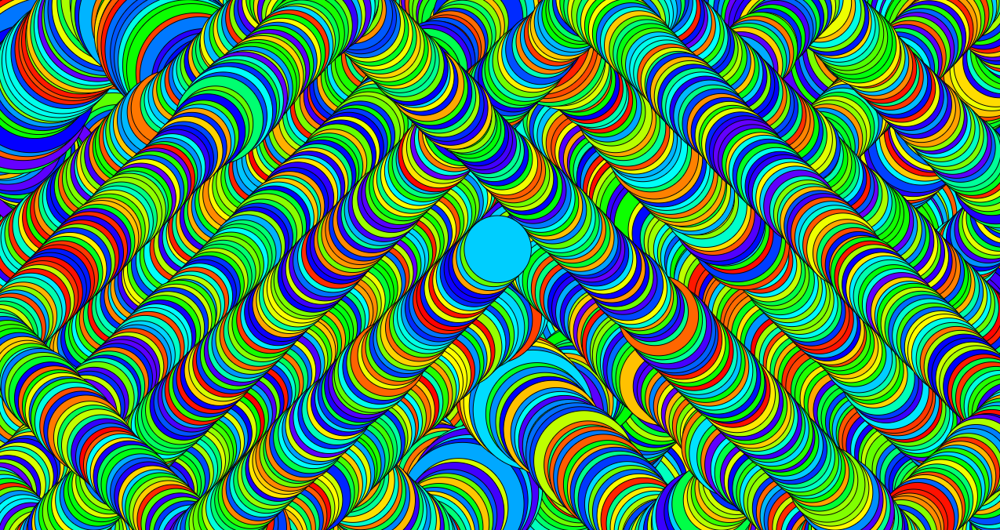

For this project, I knew I wanted to explore the possibilities of the program on a very basic level. I have some prior programming experience, meaning that this first task was pretty “rudimentary” for me. As a first task, it was of course supposed to be simple and straight forward, and I just happened to understand the assignment because of my, admittedly, minor experience gained from working with HTML in particular. 

Therefore I can not reflect over this assignment in regards to it being my first independent coding process. I can say, however, that it was much better than my actual first programming experience. I enjoy that p5 is visual in presenting its coding. You can immediately see the change you have made and react to it accordingly. 

The process of coding is never something you can learn only by reading about it. This is again where the visuals greatly help, as you can see the change you are making as you are making them. When reading, you learn of concepts and perspectives to consider when coming up with ideas for what to use programming for, but learning it has to come by you doing it yourself. In my previous experiences, I greatly relied on reading over coding and it hurt my understanding of coding severely. 

Reading about coding is not without its merits however. By seeing what is possible you might get encouraged to chase those ideas yourself. You might be more inclined to experiement and fail, knowing that virtually everyone who has ever dabbled in programming has great experience in both experimenting and failing. Sometimes both… often both. 

With this assignment, I sought to learn how p5 worked and how it differed from previous programs I have worked with. I also know myself well enough that I have a hard time stopping myself once I get started, so the assignment went through multiple changes and revisions before I turned it in, and even then I wanted to continue to tweak it. 

I may have overdone it slightly, but it helped me with understand the nature of the audio input methods that are available in the program, as well as working with canvas size and creating new functions. 

I started with making a circle, changing its color, moving it around, and creating an interaction between the user and the object, but that quickly changed when I found out you could incorporate the microphone. I connected the audio input picked up from the computer mic to the width of the moving circle, making it change its size depending on the volume of the incoming audio. In the end, I ended up with what most reassembles a psychedelic, old-school "PC-Lock-Screen"-feel, with the pathing of the circle being static. It’s a program you can just sit and stare at for a long time. Personally, I had great fun with playing loud music close to the microphone and seeing how the ball reacted to the song. 

When using the program, beware that it requires the use of a microphone to work as intended. You can experience the "Psycedelic Lock Screen" here: https://cdn.rawgit.com/AnnesFlashBack/Mini-Exercises/e67563d5/MiniEx-01/MiniEx-01/index.html 

