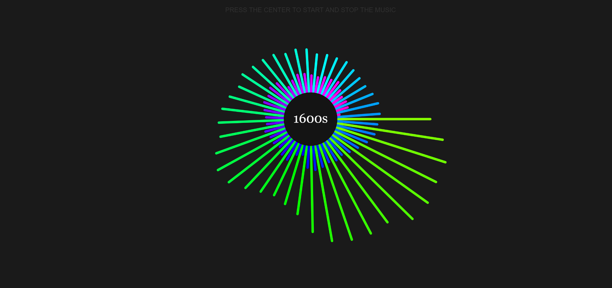

I am a big fan of music. 

I enjoy listening to it, manipulating it, and watching it. When I edit videos or do animation the audio plays a huge part in how I am able to structure a project that I am working on. It was with this mindset I began working on this assignment. 

Firstly, I considered how I wanted to make the throbber work and quickly arriving on an idea inspired by my previous experimentation with p5.js colorCode applications. The first thing I made was a perfectly round ball that had colors inside of it which would rotate around, giving the impression of a “loading” process - very much like Apple’s spinning beach ball icon. 

Following this, I knew I wanted to incorporate audio in some way, and since I was thinking of music from the perspective of “time” I thought it would be cool to set the throbber in relation to the passing of time. I knew then of a piece of music I could use: [Evolution of Music by Pentatonix](https://www.youtube.com/watch?v=lExW80sXsHs).

In this song, the artists go through different periods of time by singing the songs that came from that period. I changed my throbber so that instead of a simple circle, it was a series of lines fixed on a center point, which would then react to the frequency of the music, pulsing in response to the audio being played. 

After that, I went in and added text to pop up at certain determined points in the song to let the viewer know which timeperiod they were currently listening to, all the while the color keeps spinning and “loading” more of the song. When the song ends, as does the throbber, but it can be restarted at any point with a simple mouse click. 

You can experience my take on [Music Evolution](https://cdn.rawgit.com/AnnesFlashBack/Mini-Exercises/5978e4bd/MiniEx-03/ex-03/index.html) here. 

__

I ran into many problems while working on this project. Many of the methods I ended up using, I had never experimented with before. The cue method I didn’t even know existed at first, so in the beginning the changing of the text was tied to framecount which was incredibly unstable, to put it mildly. In addition, I was still suffering the after effects of a flu. My focus was not at all as hindered as it was last week, but it did keep me home from the “shut-up-and-code” session, which would probably have helped me greatly. 

I also ran into some trouble when uploading to GitHub. Whenever I tried to open any of my uploaded projects, I got a "512 Bad Gateway" error. Should that happen to you, you can watch a recording of the program [here.](https://youtu.be/eoiF-foHtB8)

I learned a lot working on this project however, and look forward to future assignments. Can’t wait to figure out some way of incorporating more music into my coding 😊
