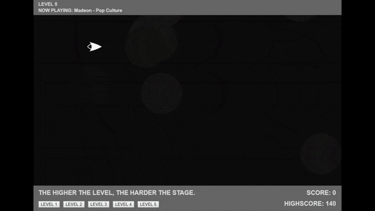

# Word of Warning

Firstly, I want to warn you that this program uses a lot of memory. Depending on your computer’s capabilities, the program might lag a little (or a lot) when you initialize it. I have tried to remedy this by making the first level the least intensive of the levels, so that you might still be able to experience the program as was intended. 

There are also a lot of files being loaded (some pictures and five songs), so be patient with the loading times, please. 

I am also aware of some bugs in the game. From my testing, this occurs mostly on less powerful machines where the bullets from the spaceship will pass over the blocks coming towards you, making the game close to impossible in some levels. This was a problem on my laptop throughout my coding process, but stopped the moment I moved to a computer with more memory. 

I believe this to be cause by the many objects flying across the screen at the same time and the framerate going jumpy as a result. Locking the program’s framerate to 60 seemed to solve this, but I cannot guarantee that it is flawless, so I apologize if your experience is lessened by this :( 

# Controls

You fly using the mouse and fire the cannon by holding down the left mouse button. You respawn the ship by hitting spacebar (or any other key). 



## The Game and Game Design

In [Song Invaders](https://cdn.rawgit.com/AnnesFlashBack/Mini-Exercises/35383eaa/MiniEx-05/ex-05/index.html) you control a little spaceship flying across a dark universe. A song plays in the background and for a few seconds, nothing will happen. Then blocks will start appearing at the right side of the screen and will fly towards the spaceship. These blocks are dangerous and will crash your ship! You must use your ship’s cannon to clear the blocks before they make it to you, or use the mobility of your ship to avoid the flying space blocks. There are multiple levels, increasing in difficulty as you go along, adding more blocks to the canvas. 

There is text on the screen to guide the user as to how to use the program, but no guide to how to control the ship. I assumed most people would quickly figure it out, since it is a pretty standard control scheme, but I realize now I should probably have included some sort of “tutorial" in the actual program.

Your score and highscore are both updated as you go through. I was inspired on how to do this by fellow student, Mark Nielsen’s MiniEx-04, where he also utilized a score and highscore system. His program can be found [here.](https://github.com/MOSN97/MiniEx/tree/master/MiniEx4) 

I also wanted to add an “auto-play” feature, meaning that when one level ended, it would automatically play the next song, but I could not make this work. Instead, you have to pick the next level yourself at the bottom of the screen. 

#### Sprites and p5.play

I utilized many of the methods found in the p5.play library, exactly because it has what is called the Sprite class. This is a little different from what we have been talking about in class, and is a class with many different methods, and functions tied to it. The Group() function proved tremendously effective! For instance, whenever a new bullet is spawned that bullet is automatically added to a group named bullets. The same for the blocks. Whenever a new block was spawned, it was likewise added to a group, either named blocks or tinyBlocks depending on its size. So, instead of keeping track of individual bullets or blocks, the program was able to detect if anything within the group bullets touched anything from the groups blocks or tinyBlocks, and react accordingly. 

#### Objects Generated Through Music

I knew that I wanted to work with music. Again. I think it adds so much more to a program when more of your senses can interact with it. It immerses you much more; especially when talking about games. The soundtracks from video games are crucial to setting the mood and feel of the scene taking place, as well as translating the feel of fun. Here, the music works in tandem with the music, since each level is generated based on data gathered from the music playing. 

For the big blocks, I used peakDetect() found in the p5.sound library. When the program detected a beat in the song playing, it would spawn a large block just off the canvas. This block was given properties by its Sprite class. 

```
function bigBlock() {
  var block = createSprite(1040, random(70,height-110), 100, 30); // Spawing coordinates and size
  block.velocity.x = -4; 
  block.life = 500; 
  blocks.add(block); 
}

function spawnBigBlocks() {
  fft.analyze();
  peakDetect.update(fft);
  if (peakDetect.isDetected) {
    bigBlock();
  }
}
```

The same was the case for the small blocks, except their spawn rate was not tied to the beats, but instead to the volume. The louder the song was, the more small blocks would appear, making the later levels quite crazy. 

```
function smallBlock() {
  var tinyBlock = createSprite(1000, random(70,height-110), 30, 20); // Spawing coordinates and size
  tinyBlock.velocity.x = -8; // Speed
  tinyBlock.life = 500; // Lifespan in frames
  tinyBlocks.add(tinyBlock); // Added to the tinyBlocks group
}

// The small blocks spawn when the program detects a higher volume
function spawnSmallBlocks() {
  var d = map(amp.getLevel(), 0, 1, 10, 200);
  if (d > 50) {
    if(frameCount%4 == 0) { // A new block is only spawned every 4 frames, otherwise the screen would be flooded with blocks
      smallBlock();
    }
  }
}
```

#### The "Standard" Class

Because everything in the actual game only utilizes the Sprite class and not the class we were taught, I wanted to experiment with combining the two. I very quickly found out that this is much easier said than done, as I could not get the two to work together. Instead of pulling my hair out over it, I instead used the standard class to make the background graphics. 

I didn’t like how static the dark background looked and wanted to add some movement to it. I made a class for an ellipse with a constructor, and a show() and move() method to make them go across the background in the same direction as the blocks. The width of these circles is determined by the volume of the song playing, and the speed as well as the color of the circles are randomly chosen upon initializing. 

```
class Bouncy { // The class for the background circles
  constructor() {
    this.getcolor = random(12, 20); // The color is different shades of dark grey
    this.x = random(0, 1000); // The spawing point is random
    this.y = random(0, 700);
    this.speed = random(-0.5, -3); // The speed is random
  }

  show() {
    var vol = map(amp.getLevel(), 0, 0.5, 130, 150);
    noStroke();
    fill(this.getcolor);
    ellipse(this.x, this.y, vol, vol); // The circles grow larger if the music is loud
  }

  move() {
    this.x += this.speed;
    if (-70 > this.x) { // If the circles go off the canvas, they will reappear on the other side and keep going
       this.x = 1070;
    }
  }
}
```

This made sort of a pseudo-3D effect, I felt. With the small blocks on top of the big blocks, and the moving dark circles in the background, it gave the canvas some much needed depth. 

#### Multiple .js Files

This was a new thing I have wanted to try ever since Shiffman mentioned it in [one of his videos.](https://www.youtube.com/watch?v=Yk18ZKvXBj4) Having your code in multiple files is very practical if you have a bunch of code like I did with this exercise. It makes it much easier to quickly find what you need, and it is very easy to set up. Simply make a new .js file, rename it, and remember to add it in the index file. Shiffman explains it better than I do, though. 

## Objects, Blocks, and Generation 
From what I have understood, an object can be seen as sort of… a thing. That might sound a bit strange, but it is the best way I can describe it. I am reminded of the philosopher Plato’s *theory of forms* when I first started thinking about this, spurred on by Shiffman’s teachings about Classes. That, by using classes, you are creating the “ideal” object. The conceptual object, before it is actually created, and from that, deviations and differences can be found. In my program, each bullet is different even though they are all stem from the same class and should be the same, but they are all unique. Their positions are different, their lifespans are different. 

When looking at the real world, everything around us could be considered an object. A red apple is an object of the Apple class, for instance, but it looks slightly different from other apples. Going with this mindset, objects could be seen as a way of applying a sort of realism to programming. This is especially noticeable in video games, particularly those made by big companies. Here, realism is a point of pride and something the developers strive to achieve. They want each object the player encounters to feel unique and real, instead of the lines of code that they are. That is why bugs and glitches are as jarring and potentially hilarious as they are when we see them in modern video games. The player is given an expectation of realism, and when that expectation is broken its clashes harshly with the player’s immersion. 

Objects have recognizable characteristics, both in programming and in the real world. There is an expectation of what can and cannot be done with this object, based on the recognizable factors the object shares with all other objects of its class. 

It is as the Plato’s *theory of forms* states; *ideas are the most accurate reality. *


##### Libraries:
- p5.play (createSprite, collide, Group, overlap etc.)
- p5.sound (peakDetect, fft, amplitude, loudsound etc.)

##### Song List:

- _Harder Better Faster Stronger_ by Daft Punk. Album: Discovery
- _Pop Culture_ by Madeon. [Youtube](https://www.youtube.com/watch?v=lTx3G6h2xyA)
- _Set Free_ by Veorra. Album: Ruby
- _War_ by Edwin Starr. Album: War and Peace
- _What Fills the Gap_ by Will Cady ft. Alan Watts. Album: The Awake

