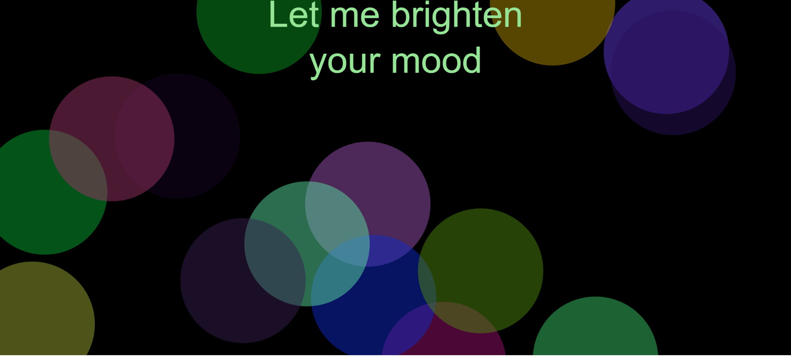

## Y0U_L16HT_UP_TH3_R00M 
##### By Alexander Svanholm, Anne Gregersen & Frederik Ditlev
### What is the Program?

When you first boot up the program **“You Light Up the Room”** you are, ironically, faced with a black screen. There are no signifers to tell you what to do, nor are there any prompts, sounds, or any visible features. The screen will remain black until you click the screen, after which the text “You light up the room” will appear in the center and a female voice will read the message aloud. Music will start to play and colored circles will begin floating in from the right side of the canvas, keeping to the background. 

If you continue to click, another message will pop up. The tone of the written text is encouraging and happy, giving you motivational compliments as you cycle through them. At first, the program seems innocent enough as it will continue to cycle through a defined set of kind phrases. It is only if you get impatient and start to click through the text rapidly that the program will change. It will stop praising and instead become more and more frustrated with its inability to give you what you need. 

Should you keep clicking rapidly, the program will eventually “crash,” leaving you with a black screen and an “Error” message. The music will stop and the circles moving in the background will disappear. After this, there is no way to restart the program other than to refresh the page and start over. 

## Click to [Get motivated:](https://cdn.rawgit.com/AnnesFlashBack/Mini-Exercises/c1f0e069/MiniEx-07/final%20version/empty-example/index.html)

#### Code Collaboration:

This project was the collaborative effort of [Alexander Svanholm](https://github.com/ubiquitousman/mini-ex), [Anne Gregersen](https://github.com/AnnesFlashBack/Mini-Exercises), and [Frederik Ditlev](https://github.com/Mightydeeze/mini_ex/tree/mini_ex_main). We spent a good amount of time spitballing ideas and thinking of possible angles of attack in the beginning of the process, ending on the idea of a bot reading compliments to the user. The sinister turn, as well as the error message, the background graphics, and the music all came organically as we worked and thought of different ideas we could implement. 

The moving graphics was a last minute addition. We didn’t much like the static, flat black of the background and wanted to incorporate something more visually interesting to stimulate the viewing experience. We knew it couldn’t be too distracting since that would take away from the main focus that was the text. 

We tried to incorporate what we had learned of **JSON** files into the project as well. Since we had the large arrays of text it seemed like an ideal choice, but we simply couldn’t get it to work. At the time, we were nearing the completion of the program and changing everything up so that the **JSON** file might work seemed like to big of an endeavor. Instead, we moved the text arrays into their own .js file so the code didn’t look so chaotic. 

#### Individual Analysis: 

From a user standpoint, we understand that there are multiple things wrong with this program. There is no way to go back to a previous state, meaning that you can’t make the program “happy” again once it begins to get angry. There is no way for the user to initially know how to use the program, though the control scheme is quite simple and easy to follow once you figure it out. The circles floating in the background can be a nuisance sometimes, as they occasionally spawn on top of one another. When they go behind the text in the middle of the screen, it can sometimes be hard to make out exactly what is written. There is also the fact that in the end the program will begin threatening the user, but it won’t actually be able to do anything as any reaction from the program is tied to the speed with which the user will click through the sentences. The user can essentially lock the program in a specific array of messages forever if they wish, which takes away from the perceived idea that the program has some sort of sentience. 

This perceiving of sentience was maybe one of the biggest struggles encountered during the creation of this program. So little action needs to be taken before the perceived "consciousness" falls to pieces, and it becomes very clear that everything the program does, has been thought out prior to interacting with it. Cox and McLean talk about "*the formal logic that undermines [the source code's] behaviour.*" The randomness and reactiveness of the program is an act, fully controlled by the user and implemented in its entirety by the programmers. Nothing happening in the program happens without reason; it was put there. 

But even knowing this, the program still has an effect. Cox and McLean also stated that "*[] speech emanated from the body; but even more fundamentally voice has been understood as a precondition of consciousness itself.*" By giving this program a voice that is its own (meaning it was not just a recording of one of the group members) the program gained somewhat of a personality. It is much like witnessing people arguing with Siri on their iPhones, or yelling at the lady in your GPS system when she tells you to make a U-turn on the highway. We feel we can yell at this mechanical voice because a part of us recognizes the ability to communicate as a sort of semi-consciousness. The user, of course, knows that the technology cannot actually understand what they are saying, but it does not stop them from engaging in conversations with it, or become frustrated at its commentary. It falls back to the idea that "*to demonstrate believability, a machine would be required to possess some kind of intelligence that reflect the capacity for human reasoning,*" (Cox and McLean) which is not found in the standard technology we use today. It has a much greater knowledge of the world at large, yes, but does not understand the intricacies of the present moment, and can therefore be seen as playing pretend at consciousness. 

In this program this is not exactly the case, as all possible outcomes are already calculated. The program does not learn or gather new information. It does not evolve based on new knowledge or try to accommodate its surroundings. Instead, it reacts on input (or impatience) from which it then evolves and changes. It is reactionary to only one parameter, which plays well into the apparent frustrations the program will eventually experience. Because it cannot gather new information or figure out "*how to make you happy*" it will eventually give up entirely, much like a program will crash if overloaded with data. 

This program was designed to seem as if it wants to make you feel better, where in reality, it seems like it just wants to understand the situation it is in so it may be of most service. In truth, it is a rather dreary thought. A program which has been created to only do one thing feels like it fails at the single thing it has been designed to do. One can only hope that the technology we yell at on a day to day basis don't store that information to later plan humanity's doom out of frustration of not being able to satisfy us. 

If that turns out to be the case, I think we are all doomed. 

## Our code:
#### Index file:
https://github.com/AnnesFlashBack/Mini-Exercises/blob/master/MiniEx-07/final%20version/empty-example/index.html
#### Sketch file:
https://github.com/AnnesFlashBack/Mini-Exercises/blob/master/MiniEx-07/final%20version/empty-example/sketch.js
#### Statements (text and speech):
https://github.com/AnnesFlashBack/Mini-Exercises/blob/master/MiniEx-07/final%20version/empty-example/statements.js

## Academic Text:
#### *Vocable Code* by Geoff Cox and Alex McLean, 2012

  #
 Best regards 
#### Alexander Svanholm, Anne Gregersen & Frederik Ditlev

