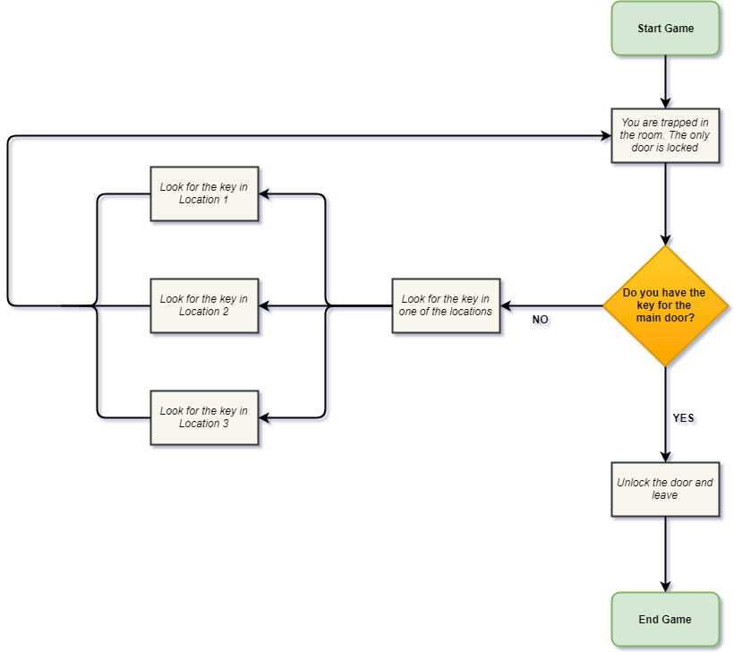
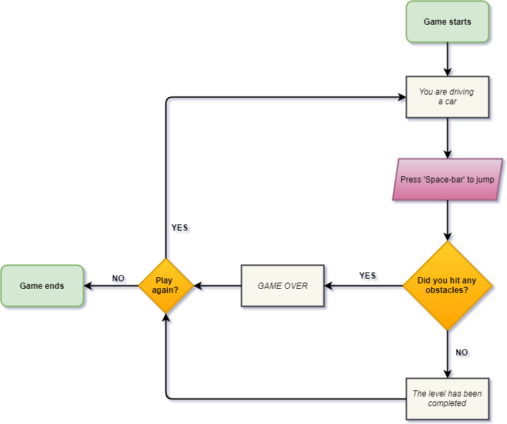
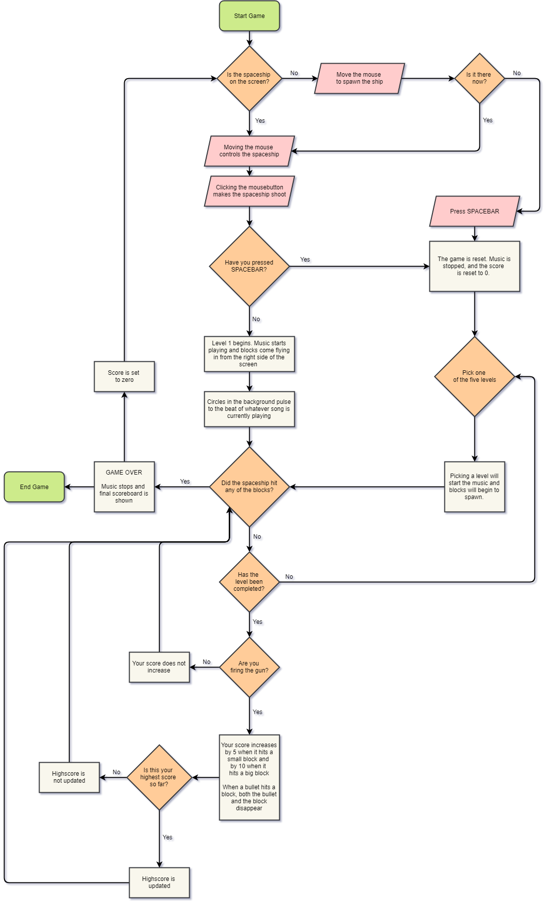

# mini_ex9 - Flowcharts
By Alexander Svanholm, Anne Gregersen & Frederik Ditlev

### The Escape Room

You are trapped inside a room and must try to figure out how to escape before the time runs out. The player needs to solve puzzles in order to get out. These puzzles can involve ciphers, finding hidden objects, filling out crosswords, matching patterns, etc..

Potential physical components of the game: Hidden doors, locked doors, locks, keys, multiple rooms.

A possible challenge for this idea might be the gathering of all the data we need, as we need to gather all the information and pictures ourselves. It will be very time consuming and require quite a bit of coordination (It would be silly to start the photoshoot before we knew what would actually be relevant to the program).

#### Flowchart of The Escape Room

### Platform Sidescroller

You are in control of a small, simple, vehicle that is driving along the road. Throughout, obstacles will appear and hitting them will crash your car. If you can successfully avoid all the obstacles and get to the end of the level, you win and may be allowed to go on to the next stage.

With this program, a challenge we could encounter is the difficulty in communicating the controls to the user. We thought of this program as a way to explore a user’s innate understanding of basic control schemes found in video games, and a technical challenge for this would be to adequately communicate the limited functions of the game to the user without using blocks of text.

#### Flowchart of Platform Sidescroller

#### Individual Analysis:
The flowchart made for this project was a much more intensive process than making the group flowcharts. This is most likely do to the influx in features and complexity that exists in an already finished piece of code over that of a simple concept. 

Working with an older project also served as a visualisation of what might have been wrong with the original product. The flowchart loops around in strange ways and is missing certain features, simple because that is how the original project was designed. Both due to time constraints and lack of ability, the polish of the code could certainly have been much better. Additions of several features, such as a way for the game to automatically move on to the next level, would have been implemented, making for a more pleasing experience, both with the game and with reading the flowchart. 

For the group flowcharts, it was based on concept, not code, which immediately lowered the complexity of the final flowchart. Since we don’t yet know enough of our end product and how it would work on a mechanical level, we couldn’t make a detailed flowchart the way we were able to do with already written code. 

#### Flowchart of Song Invaders

## Our team:
#### Alexander:
https://github.com/ubiquitousman
#### Anne:
https://github.com/AnnesFlashBack
#### Frederik:
https://github.com/Mightydeeze  

## Best regards
#### Alexander Svanholm, Anne Gregersen & Frederik Ditlev
